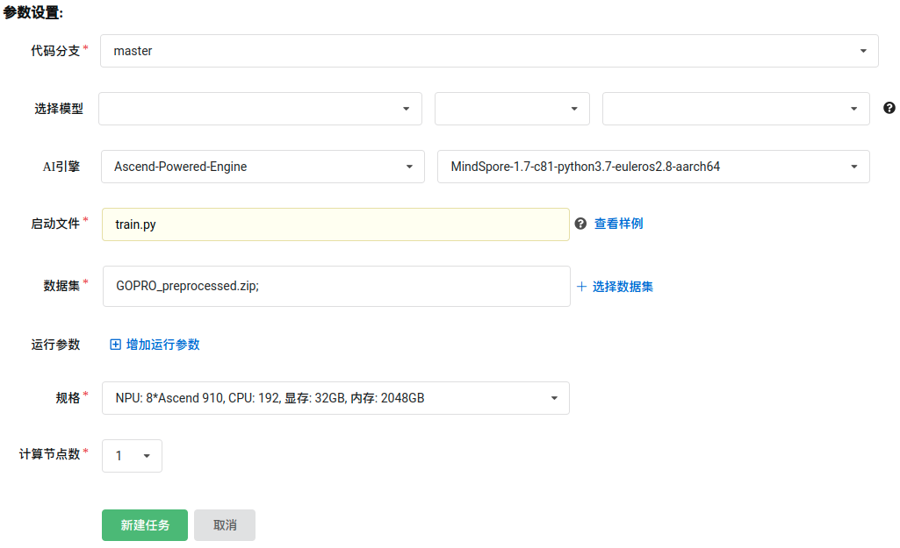
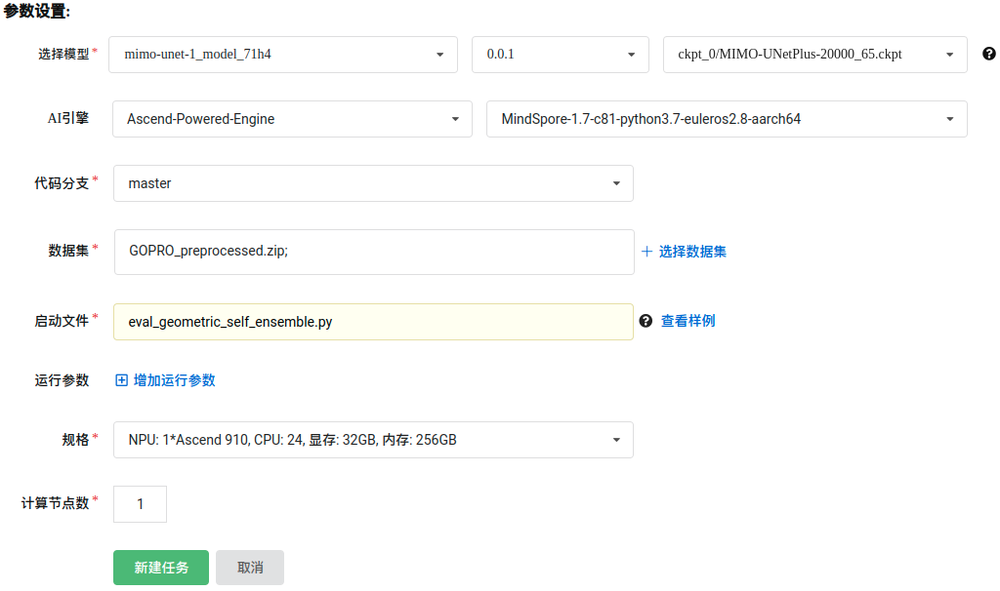

# 目录

<!-- TOC -->

- [目录](#目录)
- [MIMO-UNet描述](#MIMO-UNet描述)
- [数据集](#数据集)
- [特性](#特性)
    - [混合精度](#混合精度)
    - [数据增强](#数据增强)
- [环境要求](#环境要求)
- [代码说明](#代码说明)
    - [代码列表](#代码列表)
    - [训练超参数](#训练超参数)
- [训练和测试](#训练和测试)
    - [训练模型](#训练模型)
        - [测试模型](#测试模型)
- [模型描述](#模型描述)
    - [性能](#性能)
        - [评估性能](#评估性能)
<!-- - [ModelZoo主页](#modelzoo主页) -->

<!-- /TOC -->

# [MIMO-UNet描述](#目录)
由粗到精的策略已经广泛用于单张图片去模糊的架构设计中。典型的方法会堆叠接受多尺度输入的子网络，并从低层的子网络到高层的子网络逐渐提升图片的锐利度，不可避免地导致了很高的计算代价。论文作者重新审视了由粗到精的策略，并提出了一个多输入多输出 UNet 网络：MIMO-UNet。

# [数据集](#目录)

使用的数据集：[GOPRO](https://seungjunnah.github.io/Datasets/gopro.html)

- 数据集
    - 训练集：共 2,103 组配对图像，每组图像包含一张清晰图像和对应的模糊图像
    - 测试集：共 1,111 组配对图像，每组图像包含一张清晰图像和对应的模糊图像
- 数据格式：PNG
    - 注：数据在 dataset.py 中处理。
- 下载数据集，目录结构如下：

 ```bash
GOPRO
├─ train                             # 2,103 image pairs
│ ├─ blur
│ │ ├─ xxxx.png
│ │ ├─ ......
│ │
│ ├─ sharp
│ │ ├─ xxxx.png
│ │ ├─ ......
│
├─ test                              # 1,111 image pairs
│ ├─ ...... (same as train)
```

# [特性](#目录)

## 混合精度

采用[混合精度](https://www.mindspore.cn/tutorials/zh-CN/master/advanced/mixed_precision.html)的训练方法，使用支持单精度和半精度数据来提高深度学习神经网络的训练速度，同时保持单精度训练所能达到的网络精度。混合精度训练提高计算速度、减少内存使用的同时，支持在特定硬件上训练更大的模型或实现更大批次的训练。

## 数据增强

提出并实现了一种和去模糊这种低层视觉任务相容的数据增强方法 PairRandomRGBShuffle。

# [环境要求](#目录)

- 硬件（Ascend）
    - 使用 Ascend 来搭建硬件环境。
- 框架
    - [MindSpore](https://www.mindspore.cn/install/en)
- 如需查看详情，请参见如下资源：
    - [MindSpore教程](https://www.mindspore.cn/tutorials/zh-CN/master/index.html)
    - [MindSpore Python API](https://www.mindspore.cn/docs/api/zh-CN/master/index.html)

# [代码说明](#目录)

## 代码列表

```bash
MIMO-UNet
├── src
│   ├── model_utils                  # 训练环境相关处理
│   │   ├── config.py                # 配置文件处理
│   │   ├── device_adapter.py        # 自动选取 ModelArts 或本地训练相关处理
│   │   ├── __init__.py
│   │   ├── local_adapter.py         # 本地训练相关处理
│   │   └── moxing_adapter.py        # ModelArts 训练相关处理
│   ├── callbacks.py                 # 监测训练信息
│   ├── cell_wrapper.py              # 自定义混合精度训练
│   ├── dataset.py                   # 数据集读取及增强方法
│   ├── __init__.py
│   ├── layers.py                    # 模型基础层定义
│   ├── loss.py                      # 损失函数定义
│   ├── metrics.py                   # 计算评估指标
│   ├── MIMOUNet.py                  # 模型定义
│   └── utils.py                     # 学习率、模型载入等工具
├── default_config.yaml              # 配置文件
├── eval_geometric_self_ensemble.py  # MIMO-UNet++ 评估程序
├── eval.py                          # MIMO-UNet+ 评估程序
├── LICENSE
├── preprocessing.py                 # GOPRO 数据预处理程序
├── README.md                        # MIMO-UNet 相关说明
└── train.py                         # 训练程序
```

## 训练超参数

在 default_config.yaml 中可以配置训练和评估参数。

配置 MIMO-UNetPlus 模型和 GOPRO 数据集。

### 训练阶段主要参数
  ```yaml
    # === 数据集设置 ===
    num_parallel_workers: 8            # 数据处理并行数
    batch_size: 4                      # 每个 device 上的 batch 大小 (16 卡时为 32)

      # === 网络训练设置 ===
    num_epochs: 20000                  # 训练轮数
    lr_init: 0.0001                    # 初始学习率
    lr_decay: 0.5                      # 学习率递减率
    lr_warmup_epochs: 0                # 学习率热身轮数
    lr_num_epochs_per_decay: 500       # 学习率递减间隔轮数
    momentum: 0.9                      # AdamWeightDecay 优化器参数
    decay: 0.9                         # AdamWeightDecay 优化器参数
    epsilon: 0.000001                  # AdamWeightDecay 优化器参数
    weight_decay: 0.0                  # AdamWeightDecay 优化器参数
    enable_ema: True                   # 启用 Exponential Moving Average (EMA)
    ema_decay: 0.9999                  # EMA 参数
    enable_clip_norm: False            # 不启用梯度模长限制
    gradient_norm: 1.0                 # 梯度模长参数
  ```

更多配置细节请参考配置文件 default_config.yaml。在启智集群上可以按照如下步骤进行训练和评估：

# [训练和测试](#目录)

## 训练模型

## 测试模型


# [模型描述](#目录)

## 性能

### 评估性能

#### GOPRO 上的 MIMO-UNetPlus 模型

| 参数 | Ascend 910 |
| ---- | ---- |
| 模型 | MIMO-UNet |
| 模型版本| MIMO-UNetPlus |
| 资源 | Ascend 910 |
| 上传日期 | 2022-11-03 |
| MindSpore版本 | 1.7 |
| 数据集 | GOPRO train / test，共 2,103 / 1,111 对图像 |
| 训练参数 | epoch=20000, batch_size=4 |
| 优化器 | AdamWeightDecay |
| 损失函数 | L1Loss |
| 损失 | 0.036875 |
| 峰值信噪比 | 论文 MIMO-UNet++ PSNR: 32.68 |
| 峰值信噪比 | 8卡 训练 MIMO-UNet++ PSNR: 32.927 / 32.916 （两次实验）|
| 速度 | 8卡 训练 242.3 毫秒每步 |
| 训练耗时 （启智集群） | 87:52:12 |

<!-- # ModelZoo主页

请浏览官网[主页](https://gitee.com/mindspore/models) -->